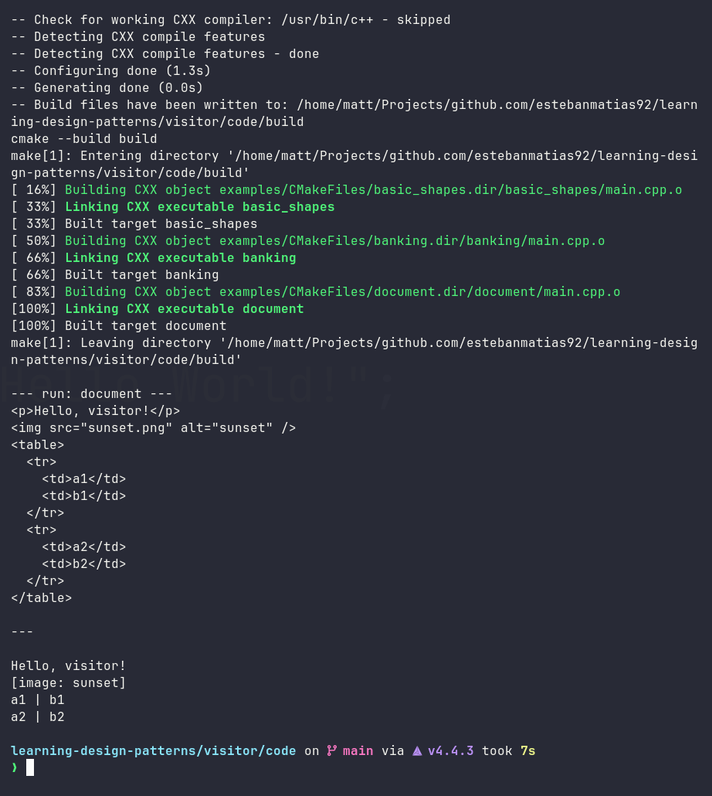

# Visitor — índice del módulo

> Módulo 1 de `learning-design-patterns`. Idioma canónico: **C++17**
> (los snippets Java/C# en las lecciones son transferencia, no el target de compilación).

**Misión:** añadir operaciones nuevas a una jerarquía estable sin editar
las clases existentes — sin cadenas `instanceof` / `dynamic_cast` regadas.
Ver [`MISSION.md`](MISSION.md).

## Lecciones (~6 min cada una)

1. [`lessons/0001-why-visitor-exists.html`](lessons/0001-why-visitor-exists.html) — cuándo Visitor encaja (expression problem)
2. [`lessons/0002-accept-visit-handshake.html`](lessons/0002-accept-visit-handshake.html) — handshake `accept` / `visit`
3. [`lessons/0003-single-vs-double-dispatch.html`](lessons/0003-single-vs-double-dispatch.html) — por qué `visit(element)` solo no basta
4. [`lessons/0004-when-not-to-use-it.html`](lessons/0004-when-not-to-use-it.html) — cuándo NO usarlo

Abrir [`index.html`](index.html) en el navegador o servir con
`python3 -m http.server -d . 8000`.

## Referencia (imprimible)

- [`reference/visitor-cheatsheet.html`](reference/visitor-cheatsheet.html) — esqueleto + dispatch en 2 líneas + reglas
- [`reference/glossary.html`](reference/glossary.html) — Visitor · Element · Expression Problem

## Código C++17

Playground reproducible en [`code/`](code/) ([README](code/README.md)):

```sh
cd code
make build
make run EXAMPLE=basic_shapes   # formas + Area + XML
make run EXAMPLE=banking        # portfolio: interés, fees, reportes
make run EXAMPLE=document       # documento: HTML vs plaintext
```

**Salida por pantalla:**



- `code/src/` — reservado para futura librería (`visitor::shapes::...`), hoy scaffolding
- `code/tests/` — reservado (compila solo con `-DVISITOR_BUILD_TESTS=ON`, sin framework aún)
- `code/build/` — efímero, nunca se commitea

## Contexto de aprendizaje

- [`NOTES.md`](NOTES.md) — decisiones (C++ canónico, prerrequisitos OOP)
- [`RESOURCES.md`](RESOURCES.md) — fuentes primarias (Guru, SourceMaking, etc.)
- [`learning-records/`](learning-records/) — registros de sesión

## Regla de oro

> Tipos estables + operaciones crecientes = Visitor.
> Tipos volátiles = virtuales planas, evita Visitor.
